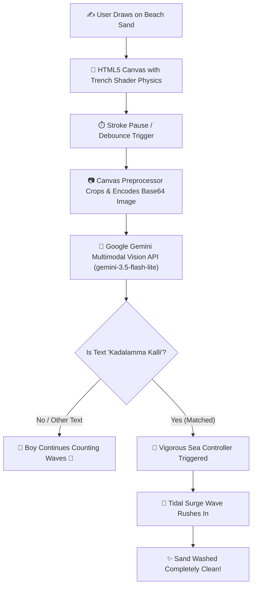

# Kadalamma Kalli 🌊🎯


## Basic Details
### Team Name: Tetris


### Team Members
- Team Lead: Safwan Muhammed - Cochin University of Science and Technology
- Member 2: Aditya Dev B - Cochin University of Science and Technology

### Project Description
An interactive, hyper-realistic seashore experience where you hand-draw text directly onto the coastal sand. A 2D silhouette boy sits faithfully on a rock on the shore counting each incoming wave, while Google Gemini Vision AI inspects your strokes in real time—the moment you dare write *"Kadalamma Kalli"* (Mother Sea, the thief), she takes offence and summons an unstoppable ocean wave that washes your writing completely away!

### The Problem (that doesn't exist)
Going to an actual beach just to write names, poetry, or heartbreak messages into the sand is exhausting. Your footwear gets filled with abrasive sand, the sun gives you a harsh tan you never asked for, and waiting hours for real-world high tide to dramatically erase your dramatic words takes way too long.

### The Solution (that nobody asked for)
A browser-based beach experience complete with realistic canvas sand trench physics, a 2D companion who counts ocean waves as they break, and cutting-edge Google Gemini Multimodal Vision AI. The instant you finish carving *"Kadalamma Kalli"*, Mother Sea herself is insulted and rushes in with a foamy tidal surge to wipe the sand completely clean!

## Technical Details
### Technologies/Components Used
For Software:
- **Languages used**: TypeScript, JavaScript, HTML5, CSS3
- **Frameworks used**: Next.js 16 (Turbopack, App Router), React 19, Tailwind CSS
- **Libraries used**: `@google/genai` (Google Gen AI SDK), HTML5 Canvas 2D Context API, Web Audio API
- **Tools used**: Google Gemini 3.5 Flash Lite Vision API, FFmpeg (video & asset optimization), Git, VS Code

For Hardware:
- *Not Applicable (Pure Software Project)*

### Implementation
For Software:

# Installation
```bash
# Clone the repository
git clone https://github.com/Saf369/kadalamma_kalli.git
cd kadalamma_kalli

# Install project dependencies
npm install
```

# Environment Setup
Create a `.env` file in the root directory:
```env
GEMINI_API_KEY="your_google_gemini_api_key_here"
GEMINI_MODEL="gemini-3.5-flash-lite"
```

# Run
```bash
# Start the local development server
npm run dev
```
Open [http://localhost:3000](http://localhost:3000) in your browser.

---

### Project Documentation
For Software:

# Screenshots (Add at least 3)


*Live shoreline view showing the 2D silhouette boy sitting on the sand counting ocean waves in real time.*


*Real-time handwriting recognition on sand canvas with Gemini Vision confidence scoring and phrase verification.*


*Target phrase "Kadalamma Kalli" recognized with 99% confidence, awakening the sea and triggering the tidal wave surge.*

# Diagrams


*System Workflow: from user strokes on sand, to Gemini Multimodal Vision recognition, to the triggered ocean wave wipe.*

---

### Project Demo
# Video
[Watch Project Demo Video on Google Drive](https://drive.google.com/file/d/1F2gGYB5HwFHcc8Tt0UANLe5lSH8WH2ma/view?usp=sharing)

*Demonstrates interactive sand writing, the 2D wave-counting boy on the shore, Gemini Vision detecting "Kadalamma Kalli", and the sudden tidal wave that rushes in to erase the writing.*

# Additional Demos
- GitHub Repository: [https://github.com/Saf369/kadalamma_kalli](https://github.com/Saf369/kadalamma_kalli)

---

## Team Contributions
- **Safwan Muhammed**: Core architecture, Next.js application, Canvas sand rendering engine, Gemini Vision API integration, video wave synchronization, and wave counting companion.
- **Aditya Dev B**: UI/UX design, interactive aesthetic enhancements, audio curation, and testing.

---
Made with ❤️ at TinkerHub Useless Projects 


